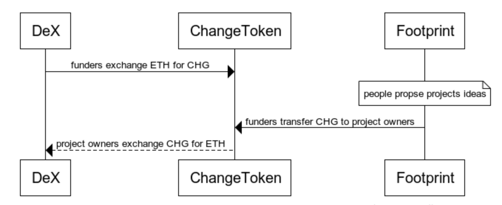
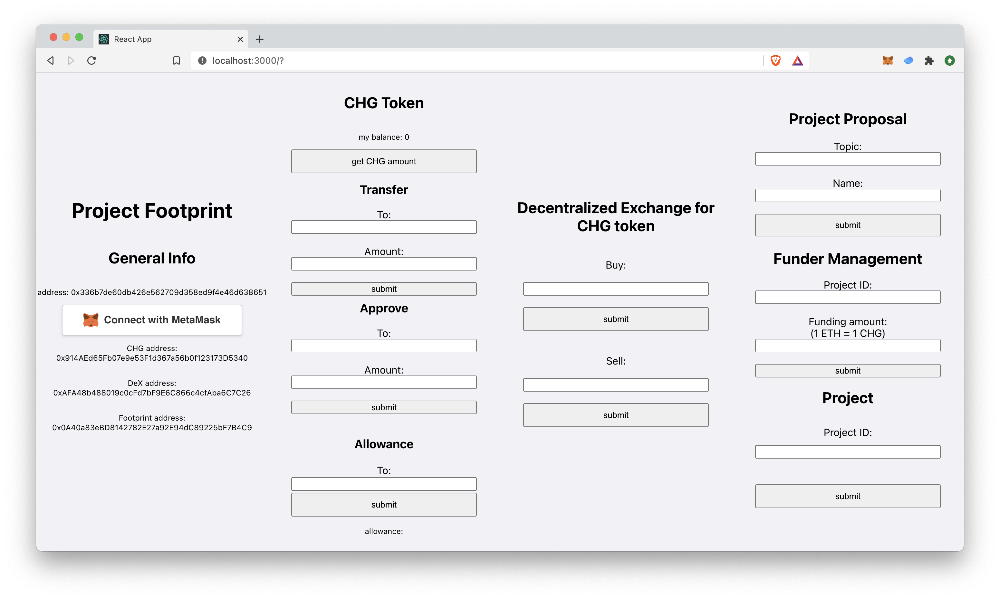

Footprint \
a decentralized funding platform for social projects 
=================

  \
Footprint allows everyday people to contribute to this world in two ways, work on projects that's important to them and propose on Footprint to get financial support, or become a funder and help others achieve their goals. The platform aims to change the world for the better by hosting projects to solve important and urgent issues we face today. Education, Climate Change, Mental Health, and countless other problems that need soving.\
Change token, or CHG, is the token on Footprint for funders to support meaningful projects. \


## Directory Structure
* truffle-react - main directory, from truffle react box, contains all three contracts, frontend react code (under client folder)
* docs - documents on design pattern, security methods, and contract address  
* img - images of projects (project logo, token logo, screenshots)
* resources - learning material, better UI template,  future reference

## Contracts
* Footprint.sol - platform for proposing and funding projects
* CHGToken.sol - CHG token 
* DEX.sol - decentralized exchange of ETH anf CHG

Interaction between contracts:\



## Run Project Locally
### React 
Under _truffle-react/client directory_,
run ``` npm install ``` to get all necessary dependencies,
then run ``` npm start ``` to start local host server

### Truffle (if re-deploying contracts)
Under _truffle-react_ directory,
run ``` truffle compile ``` to compile contracts,
then run ``` truffle migrate --network rinkeby --reset ``` to deploy contracts to Ethereum rinkeby testnet,
optionally, run ``` truffle test ``` to run test cases on contracts (defined under _truffle-react/test_).
After successfully deploying contracts, make sure to go to _truffle-react/client/src/contracts_ to get all contracts abi and address information and put into _abi.js_ 

Deployment process: 
After running ``` truffle migrate ```, truffle will deploy DEX.sol first, which in its constructor deploys CHGToken.sol, then we'll take the address of CHG token and pass it as a parameter to deploy Footprint.sol

## App



## Future Improvements 
* project owned by multiple addresses
* voting rights for CHG token holders
    * vote on pending projects before entering
    * vote on funding direction
    * propose new topics
* each topic has its own mini-token

<p float="left">
    
    
    
</p> 

* funders get NFT as reward and receipt for funding projects


* better frontend UI design 
    * use the template in resources folder


